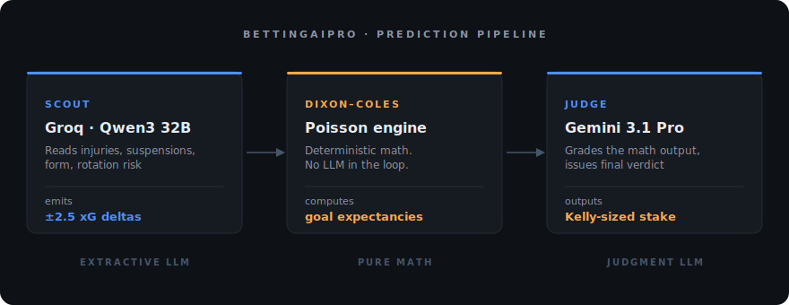

  

  <em>Frontend dev building Python backends with LLM pipelines.</em>

  

---

<h3 align="center">🚧 Currently building</h3>

  
  <h3><a href="https://betting-ai-pro.vercel.app">BettingAIPro</a> &nbsp;· <em>live</em></h3>
  
<em>An AI sports prediction app — a two-model pipeline that turns live football data into probability-graded bets with Kelly-sized stakes.</em>

  

The Scout never predicts. It reads intel (injuries, suspensions, form, rotation risk) and emits bounded numeric deltas — max ±2.5 xG on injuries, ±1.0 on suspensions — into a deterministic Dixon-Coles Poisson engine. The Judge then re-grades the math. Three roles, sharply separated: extractive LLM → pure math → judgment LLM. Every prediction is auditable down to which intel line moved which xG component.

**Stack** &nbsp;·&nbsp; Next.js 16 · React 19 · TypeScript · Tailwind 4 &nbsp;·&nbsp; FastAPI · PostgreSQL (Supabase) &nbsp;·&nbsp; Groq (Qwen3 32B) · Gemini 3.1 Pro &nbsp;·&nbsp; Discord.py for bots

---

<h3 align="center">📊 Activity</h3>

    
    
  <picture>
    <source media="(prefers-color-scheme: dark)" srcset="https://raw.githubusercontent.com/Hea092024/Hea092024/output/github-contribution-grid-snake-dark.svg" />
    <source media="(prefers-color-scheme: light)" srcset="https://raw.githubusercontent.com/Hea092024/Hea092024/output/github-contribution-grid-snake.svg" />
    
  </picture>

